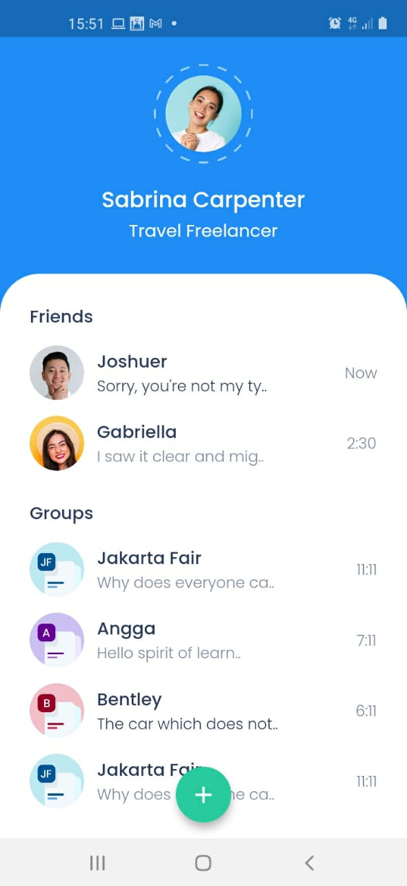

# chatty

A new Flutter project.

## Getting Started




## Insight
Untuk perulangan widget, kita bisa membuat dan menggunakan variable dan statelesswidget.
- theme
    ```dart
    import 'package:flutter/material.dart';
    
    Color blueColor = Color(0xff1F8DF5);
    Color whiteColor = Color(0xffFFFFFF);
    Color lightBlueColor = Color(0xff9ED0FF);
    Color blackColor = Color(0xff2C3A59);
    Color greyColor = Color(0xff808BA2);
    Color greenColor = Color(0xff29CB9E);
    
    TextStyle titleMainStyle = TextStyle(
      color: whiteColor,
      fontWeight: FontWeight.w500,
      fontSize: 20,
    );
    
    TextStyle subTitleMainStyle = TextStyle(
      color: lightBlueColor,
      fontWeight: FontWeight.w400,
      fontSize: 16,
    );
    
    TextStyle titleTextStyle = TextStyle(
      color: blackColor,
      fontWeight: FontWeight.w500,
      fontSize: 16,
    );
    
    TextStyle subtitleTextStyle = TextStyle(
      color: greyColor,
      fontSize: 14,
      fontWeight: FontWeight.w300,
    );
    ```

- chat tile
    ```dart
    import 'package:flutter/material.dart';
    import 'package:chatty/theme.dart';
    
    class ChatTile extends StatelessWidget {
      final imageURL;
      final name;
      final chat;
      final time;
      final bool unread;
    
      ChatTile({this.imageURL, this.name, this.chat, this.time, this.unread});
    
      @override
      Widget build(BuildContext context) {
        return Padding(
          padding: EdgeInsets.only(top: 16),
          child: Row(
            children: [
              Image.asset(
                imageURL,
                height: 55,
                width: 55,
              ),
              SizedBox(width: 13,),
              Column(
                crossAxisAlignment: CrossAxisAlignment.start,
                children: [
                  Text(
                    name,
                    style: titleTextStyle,
                  ),
                  Text(
                    chat,
                    style: unread
                        ? subtitleTextStyle.copyWith(
                            color: blackColor
                    ): subtitleTextStyle,
                  )
                ],
              ),
              Spacer(),
              Text(
                time,
                style: subtitleTextStyle,
              ),
            ],
          ),
        );
      }
    }
    ```
This project is a starting point for a Flutter application.

A few resources to get you started if this is your first Flutter project:

- [Lab: Write your first Flutter app](https://flutter.dev/docs/get-started/codelab)
- [Cookbook: Useful Flutter samples](https://flutter.dev/docs/cookbook)
- [builth with angga deign to code flutter](https://www.buildwithangga.com/kelas/flutter-for-designer-design-to-code)


For help getting started with Flutter, view our
[online documentation](https://flutter.dev/docs), which offers tutorials,
samples, guidance on mobile development, and a full API reference.
